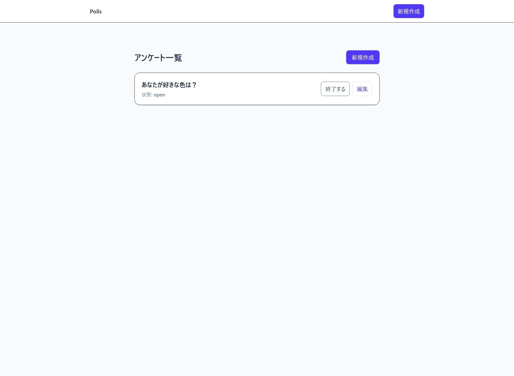

# 🗳️ AI Agent Bake-off: Polls 2025-09

Rails 8 を用いた **アンケート（投票）アプリ** の開発を、
複数の **AI Agent** に任せて成果物を比較する実験用のリポジトリです。

## Preview



### 🌐 Live Demo

**Demo URL**: https://ai-agent-bakeoff-polls-codex.up.railway.app/

⚠️ **注意**:
- テスト環境のため、アクセスできない場合があります
- 個人情報や機密情報の入力は絶対に避けてください
- データは定期的にリセットされます

## 🚀 プロジェクト概要

- **テーマ**: 投票アプリ（Poll / Choice / Vote モデル）
- **目的**: 異なる AI Agent の
  - 設計力
  - 実装力
  - UI/UX 表現力
  - commit 粒度やログ品質
  を比較評価すること
- **ルール**:
  - 初期セットアップ（`rails new` など）は人間が実施
  - 以降の実装は AI Agent が `AGENTS.md` に従って commit
  - 人間は検証・フィードバックのみ担当

## 🛠️ 開発環境

- **Framework**: Rails 8 (minimal)
- **DB**: SQLite
- **CSS**: Tailwind (tailwindcss-rails)
- **JS**: importmap
- **その他**: Redis 不使用

## 📂 リポジトリ構成

```
.
├── AGENTS.md        # AI Agent 用の開発ガイドライン
├── app/             # Rails アプリケーション本体
└── README.md
````

## ⚡ セットアップ

```bash
# 依存インストール
bundle install

# DB 作成
bin/rails db:create

# 開発サーバ起動
gem install foreman
bin/dev
````

## 📊 成果物の比較方法

- 各 **AI Agent の実装成果物はブランチごとに分けて管理** しています。  
- `main` ブランチには初期セットアップ（人間による scaffold 最小構成）のみが含まれています。  
- `claude-opus-4.1`, `codex-1-high` などのブランチに、それぞれの AI Agent が `AGENTS.md` に従って実装した成果物が格納されています。  

### 🔀 ブランチ切替時のDBリセット（重要）

各ブランチはマイグレーション/スキーマが異なるため、**ブランチを切り替えたらDBをリセットして seed を適用**してください。

```bash
bin/rails db:reset
```

## 📑 コミット規約（抜粋）

- **AI Agent のコミット**  
  - 必ず `🤖 <type>: <description>` 形式（Conventional Commits 準拠）  
  - 例:  
    - `🤖 feat: add Poll model and migration`  
    - `🤖 fix: validate voter_hash uniqueness`  

- **人間のコミット**  
  - 必ず `🧑 <type>: <description>` 形式（Conventional Commits 準拠）  
  - 例:  
    - `🧑 chore: update AGENTS.md rules`  
    - `🧑 docs: refine README setup guide`  
